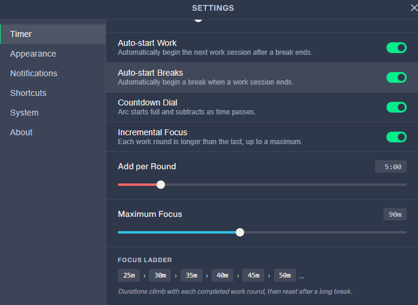
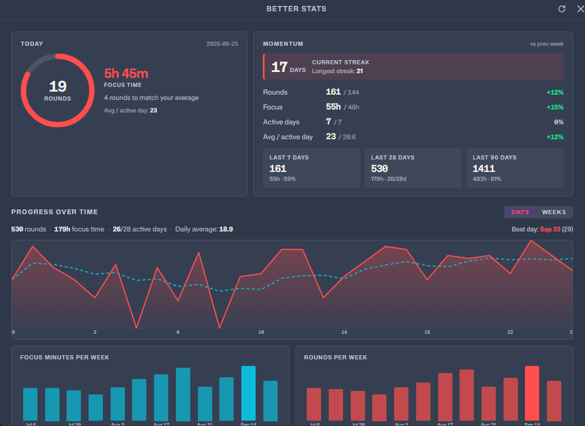
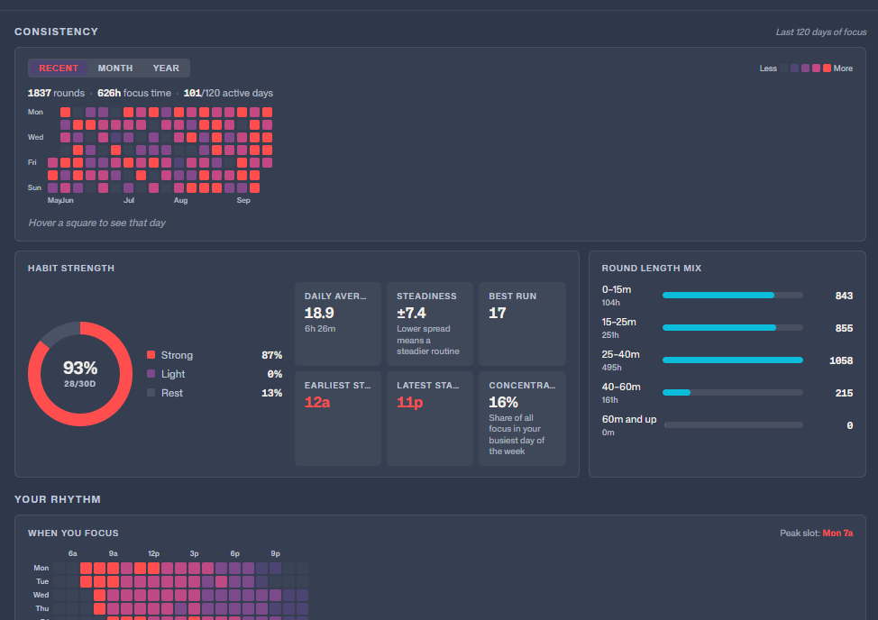
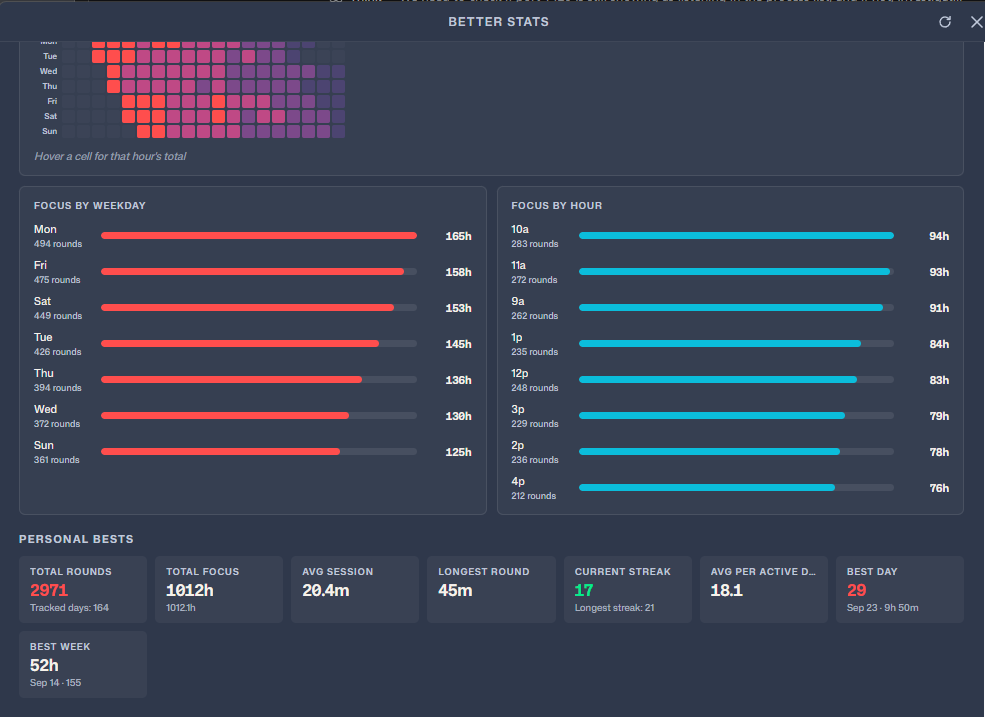

<div align="center">
  
</div>
<div align="center">
  
</div>

<p align="center">Simple and visually-pleasing Pomodoro timer.</p>

---

> ## 🍴 This is a fork
>
> This repository is a fork of **[Splode/pomotroid](https://github.com/Splode/pomotroid)** by
> [Christopher Murphy](https://github.com/Splode), maintained by
> **[gluansinha-star](https://github.com/gluansinha-star)**.
>
> All of the original application — the timer engine, themes, localization, tray integration,
> WebSocket API, and the entire Tauri/Rust/Svelte architecture — is upstream work. This fork adds
> two user-facing features on top of it: **Incremental Focus** and a much deeper **Better Stats**
> window. See [Fork additions](#fork-additions) for exactly what changed and how to get it.
>
> Want the upstream project? Use **[Splode/pomotroid](https://github.com/Splode/pomotroid)**. Bug
> reports about the features below belong here; anything about the original app belongs upstream.

---

- [Overview](#overview)
- [Fork additions](#fork-additions)
  - [Incremental Focus](#incremental-focus)
  - [Better Stats](#better-stats)
- [Screenshots](#screenshots)
- [Features](#features)
- [Statistics](#statistics)
- [Themes](#themes)
- [Install](#install)
- [WebSocket API](#websocket-api)
- [Development](#development)
- [License](#license)

## Overview

Pomotroid is a simple and configurable Pomodoro timer. It aims to provide a visually-pleasing and reliable way to track productivity using the Pomodoro Technique.

Built with [Tauri 2](https://tauri.app), [Rust](https://www.rust-lang.org), and [Svelte 5](https://svelte.dev).

## Fork additions

Everything in this section is new in this fork. Each feature is opt-in and preserves the original
behaviour when switched off, so the app still works exactly like upstream by default.

### Incremental Focus

A work ladder that grows as you go: **each completed focus round makes the next one longer**, with a
configurable ceiling.

Set it up in **Settings → Timer → Incremental Focus**:

| Setting              | Meaning                                                        | Default |
| -------------------- | -------------------------------------------------------------- | ------- |
| **Incremental Focus** | Master on/off switch                                          | off     |
| **Add per Round**     | Minutes added after each completed focus round                  | 5 min   |
| **Maximum Focus**     | Ceiling for the escalated duration                              | 90 min  |

<div align="center">
  
</div>

With the default 25-minute focus and a 5-minute increment capped at 45 minutes, the ladder runs
**25 → 30 → 35 → 40 → 45 → 45 → …**. The settings panel renders a live preview of the ladder so you
can see the shape before you commit to it.

How it behaves:

- The **first** round uses your configured Focus duration as-is; the increment applies from the
  second round onward.
- The ladder **resets after a long break**, and on a manual Reset, so every cycle starts fresh from
  the base duration.
- **Breaks are never escalated** — only work rounds grow.
- A misconfigured cap below the base duration is clamped up, so the work round can never get
  *shorter* than your configured Focus time.
- While a work round is running, a small caption under the round label shows the current position,
  e.g. `25m +10m · step 3`, and `· capped` once the ceiling is reached.

Implementation notes: the ladder lives in `SequenceState` (`src-tauri/src/timer/sequence.rs`) and
reaches the frontend through new `TimerSnapshot` fields (`incremental_work_enabled`, `base_work_secs`,
`work_increment_secs`, `work_max_secs`, `increment_steps`, `at_increment_cap`). Three new settings are
persisted via **MIGRATION_7**, so existing databases upgrade without losing anything.

### Better Stats

The original Statistics window is still there and untouched. This fork adds a second, separate
**Better Stats** window (`better-stats`), opened from the new trend-line button in the titlebar, next
to the original chart button.

It is built around answering "how am I actually doing?" rather than just listing totals:

<div align="center">
  
</div>

**Momentum**
- A progress ring comparing today against your trailing 7-day average, with a plain-language verdict
  ("3 rounds to match your average", "Average matched — keep going").
- Week-over-week comparison table for rounds, focus time, active days, and average per active day,
  each with a signed percentage change.
- Rolling 7-day, 28-day, and 90-day window cards.
- A streak strip that warns when a live streak has nothing logged yet today.

**Progress over time**
- A 28-day area chart with the 7-day moving average overlaid as a dashed line, and a day/week toggle.
- A 12-week rollup shown as both focus-minutes and rounds bar charts.

**Consistency**
- An interactive heatmap with three scopes:
  - **Recent** — the trailing 120 days as a rolling contribution grid.
  - **Month** — a real calendar month: weekday columns, day numbers, rounds count per cell, today
    outlined, future days dashed, with `‹ ›` navigation.
  - **Year** — a whole calendar year in the weeks-as-columns layout.
- Habit strength: a donut splitting the last 30 days into strong / light / rest days, plus active-day
  ratio, daily average, steadiness (standard deviation of daily rounds), and best run.
- Your focus window (earliest and latest start hour) and how concentrated your focus is in your
  busiest weekday.
- A round-length histogram bucketed into under 15 / 15–25 / 25–40 / 40–60 / 60+ minutes.

<div align="center">
  
</div>

**Rhythm**
- A weekday × hour grid showing exactly when you focus, with the peak slot called out.
- Ranked focus-by-weekday and focus-by-hour breakdowns.

**Personal bests**
- Longest round, best day (by rounds and by focus time), best week, average round length, total
  tracked days, and longest streak.

<div align="center">
  
</div>

Everything arrives in a single IPC call (`stats_get_insights`), so the window has no staggered
loading. Durations are formatted the way people read them: `45m`, then `1h 30m`, and whole hours once
you pass ten (`12h`) — minute precision stops being meaningful at that scale.

**A note on correctness.** While building this I found and fixed a real bug in the fork's date
arithmetic: the day-number-to-date inverse was off by one day *and* the weekday index was misaligned,
which made the 28-day trend and the weekly chart render entirely as zeros. Both are now verified
against known calendar facts (`2026-09-25` is a Friday, `1970-01-01` a Thursday, `2024-02-29` a valid
leap day) and pinned by tests in `src-tauri/src/db/queries.rs`.

## Screenshots

<div align="center">
  
</div>

## Features

- **Incremental Focus** — a work ladder that lengthens each round, with a configurable ceiling *(this fork)*
- **Better Stats** — momentum, consistency heatmaps, rhythm grids, and personal bests *(this fork)*
- **Configurable timer** — customise work duration, break durations, and the number of rounds per long break
- **Statistics** — daily, weekly, and all-time session history with charts and a 52-week heatmap
- **38 bundled themes** — including Dracula, Nord, Tokyo Night, Catppuccin, Gruvbox, Rose Piné, and more; auto-switches with your OS light/dark preference
- **Custom themes** — drop a JSON file into the themes folder; applied instantly without a restart
- **Localization** — 8 languages: English, Spanish, French, German, Japanese, Chinese (Simplified), Turkish, and Portuguese; auto-detects OS language
- **Global shortcuts** — control the timer from anywhere, even when the window is hidden
- **Custom audio** — replace the built-in alert sounds with your own files
- **Tick sounds** — optional ticking during work and break rounds, independently toggleable
- **Dynamic tray icon** — progress arc updates in real time; reflects round type and pause state
- **Minimise / close to tray** — keep Pomotroid running in the background
- **Desktop notifications** — native OS alerts on round transitions
- **Compact mode** — a minimal set of controls appears when the window is resized small
- **Always on top** — optionally keep the timer above other windows
- **WebSocket server** — opt-in local server for stream overlays and external integrations
- **Diagnostic logging** — rotating log file with a one-click shortcut to the log folder

## Statistics

Pomotroid tracks every completed session and surfaces the data across three views: a daily summary with an hourly breakdown, a weekly bar chart with streak tracking, and an all-time 52-week heatmap.

This fork keeps that window and adds the richer [Better Stats](#better-stats) window alongside it.

## Themes

Pomotroid ships with 38 themes and supports fully custom themes with live hot-reload.


See [THEMES.md](./THEMES.md) for the full theme list and instructions on creating your own.

## Install

### Download

Download the latest release from the [upstream releases](https://github.com/Splode/pomotroid/releases) page — this fork does not publish its own releases.

Available for **Windows** (installer + standalone exe), **macOS** (universal DMG), and **Linux** (`.deb` + AppImage).

> **Note:** Pomotroid is currently unsigned. Depending on your OS security settings you may see a warning on first launch — this is expected and can be safely dismissed.

### Linux notes

**System tray on GNOME:** GNOME does not display tray icons by default. To use the tray icon feature (Settings → System → Show in System Tray), install the [AppIndicator and KStatusNotifierItem Support](https://extensions.gnome.org/extension/615/appindicator-support/) extension, then log out and back in. On Fedora: `sudo dnf install gnome-shell-extension-appindicator`. On Debian/Ubuntu it is pre-installed. Other desktop environments (KDE Plasma, XFCE, Cinnamon, MATE) support tray icons natively with no extra steps.

### Homebrew (macOS)

```sh
brew install --cask pomotroid
```

> The Homebrew cask is maintained separately and may lag behind the latest release. Check the [releases](https://github.com/Splode/pomotroid/releases) page for the most current version.

## Custom Themes

Pomotroid supports user-created themes with automatic hot-reload — no restart required. See [THEMES.md](./THEMES.md) for directory paths, the full color reference, and a step-by-step guide.

## WebSocket API

Pomotroid exposes an optional WebSocket server (disabled by default) for integration with external tools, stream overlays, and automation scripts.

**Enable it** in Settings → Advanced → WebSocket Server, then connect to `ws://127.0.0.1:<port>` (default port: 1314).

### Messages

**Client → Server**

| Message                  | Description                     |
| ------------------------ | ------------------------------- |
| `{ "type": "getState" }` | Request the current timer state |

**Server → Client**

| Event         | Payload             | Description                                      |
| ------------- | ------------------- | ------------------------------------------------ |
| `state`       | `TimerState` object | Response to `getState`                           |
| `roundChange` | `TimerState` object | Fired whenever the timer advances to a new round |
| `error`       | `{ message }`       | Protocol error                                   |

`TimerState` fields: `elapsed_secs`, `total_secs`, `is_running`, `is_paused`, `round_type`, `work_round_number`, `work_rounds_total`.

## Development

See [CONTRIBUTING.md](./CONTRIBUTING.md) for full setup instructions, project structure, and the release process.

### Quick start

```bash
# Install dependencies
npm install

# Run in development mode (hot-reload)
npm run tauri dev

# Build a production release
npm run tauri build
```

### Localization

UI strings live in `src/messages/<locale>.json` (en, es, fr, de, ja, zh, pt, tr). The compiled output in `src/paraglide/` is generated at build time and is not committed to the repository.

**During development**, the Paraglide Vite plugin compiles messages automatically whenever `npm run tauri dev` or `npm run tauri build` is run — no manual step required.

**After adding or changing message keys**, regenerate the output explicitly so that `svelte-check` and your editor can pick up the new types:

```bash
npm run paraglide:compile
```

This is also run automatically as part of `npm run check`.

### Development helpers

Two small Node scripts were added in this fork to make working on the new features easier:

```bash
# Fill the local database with ~200 days of realistic history so the stats
# windows have something to show. Clears existing sessions first.
# Run with --clear to wipe sessions without seeding.
node scripts/seed-demo-data.mjs

# Add any missing message keys to every locale file, falling back to the
# English string. Existing translations are never overwritten.
node scripts/sync-messages.mjs
```

To preview the UI in a plain browser without the Tauri shell, run `npm run dev` and open
<http://localhost:1420>. A dev-only mock (`src/lib/dev/mockTauri.js`, imported from the root layout)
stands in for the Rust backend so the windows render and the timer ticks. It is guarded by
`import.meta.env.DEV` and is never part of a production build.

### Checking your changes

```bash
# Type-check Svelte + TypeScript (also regenerates Paraglide messages)
npm run check

# Rust unit tests
cd src-tauri && cargo test
```

## License

MIT &copy; [Christopher Murphy](https://github.com/Splode)
